# Blue10 and AI
### Navigating the wonderful world of Magical systems

---
# Hi👋, I'm Yasen

- Head of Engineering at Blue10
- Making software for grownups for a decade
- @nibblebit@programming.dev

![[ProgrammingDevQR.svg]]

---
# Today

- A bit about Blue10
- Our AI and ML solutions
- The Trust Problem
- Blue10's ML engineering strategy
- Azure Architecture
- learnings

---

![[blue10-logo.svg|150]]
- Document processing
- Human Workflow
- Transaction Prediction
- 3rd party integrations

---

###  Import Documents

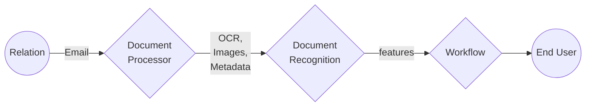

---
### Workflow

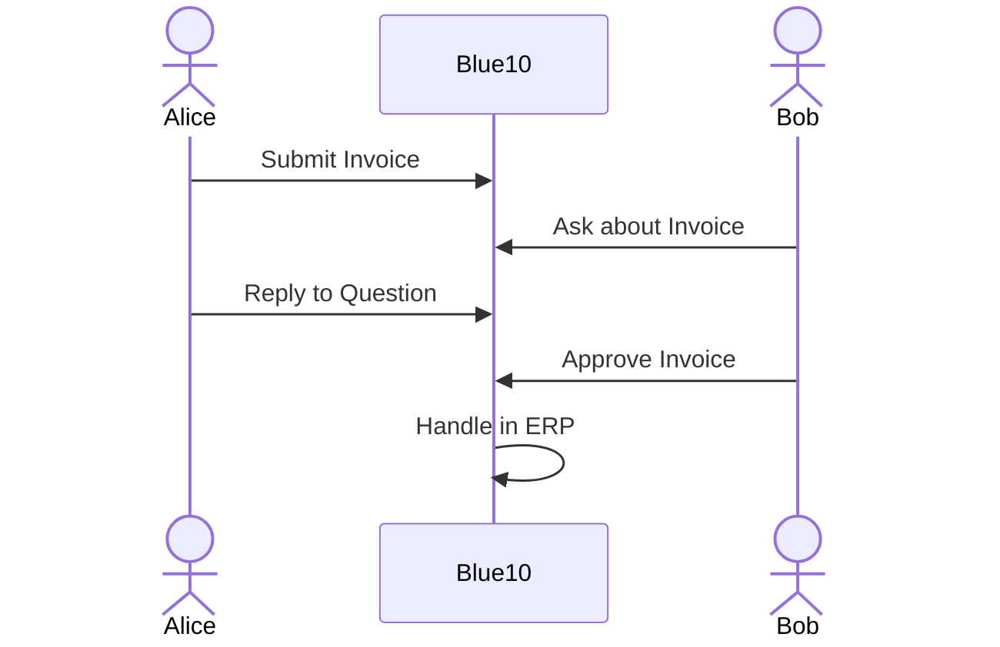
---
### Booking prediction

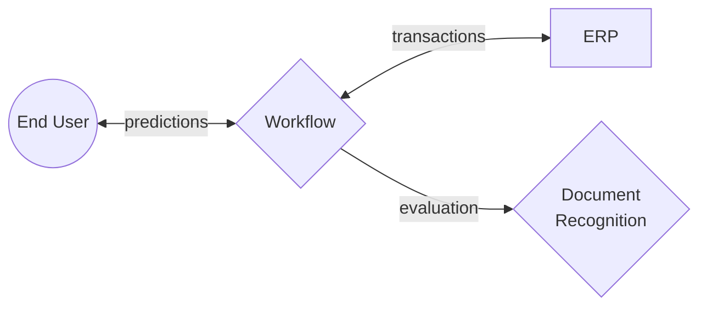
---
## What do we use AI for?

- document recognition
- transaction prediction
- workflow automation
---
### Document Recognition
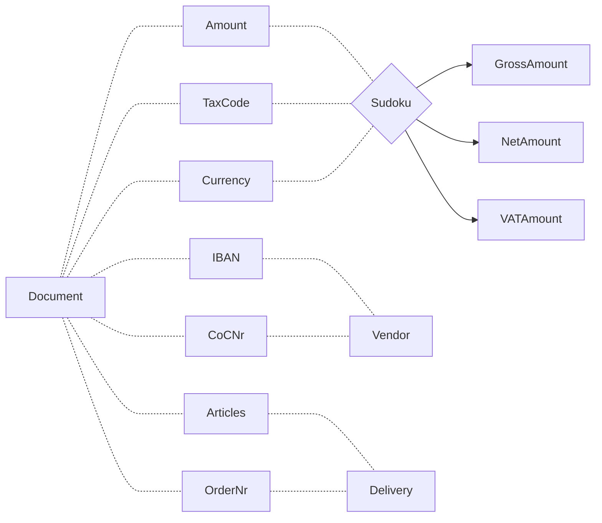
---
## Transaction prediction
*Connecting Context*
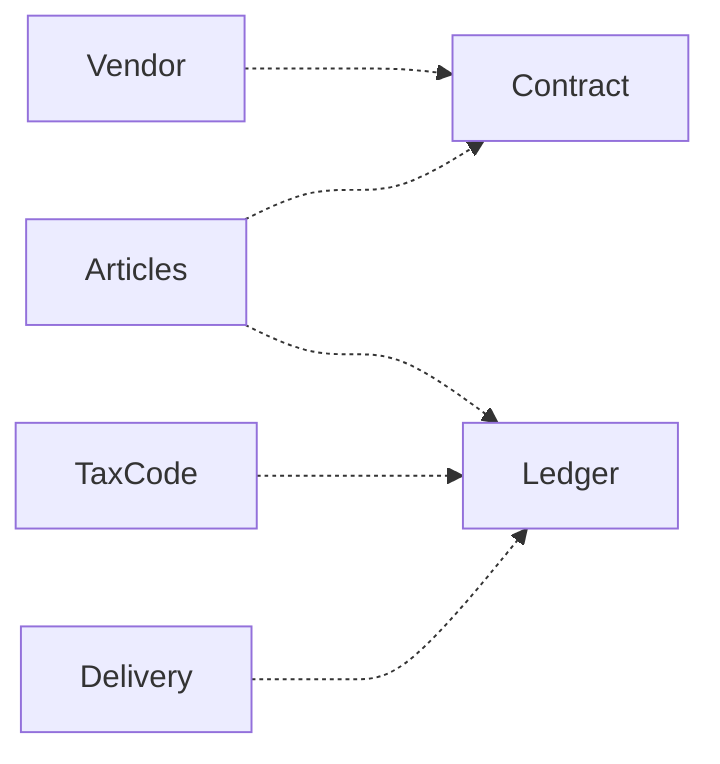
---
### Workflow optimisation
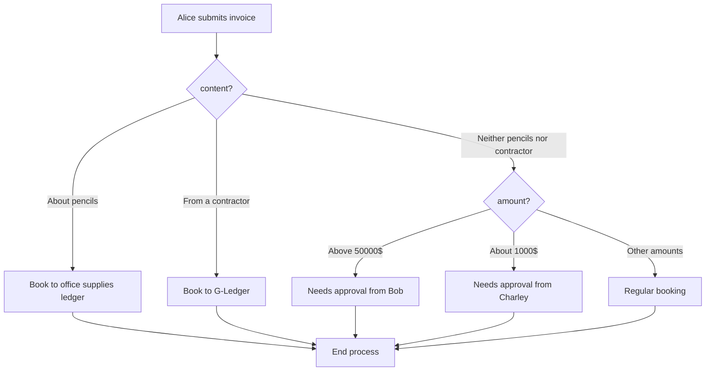
---

# Fundamentals

---
## Muggle Machines 🤓
*Just a some simple rule-based logic*
- arithmetic
- regex
- testable code

---
## Magic Machines 🧙‍♂️
*When CS is more art than science*
- Neural Networks
- Genetics
- LLMs

---
## Signals 

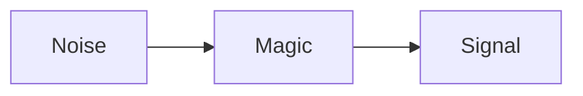

---
## Features
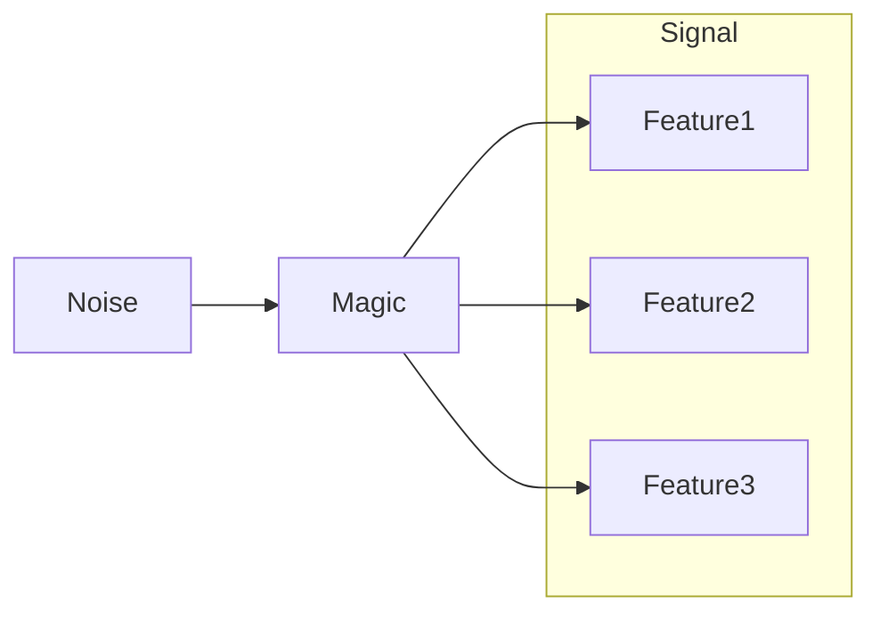
---

### Software for grown-ups👶

*Great software minimizes engagement.*

--- 
## The Trust Problem
*Value starves from lack of trust*

---
## In summary...

1. Magic machines provide value at scale, but defects are less actionable
2. Users double-check results of a defective machine
3. Software that engages users less is more valuable

>Therefore our primary focus should be all about Building Trust in users

---

# Building Trust

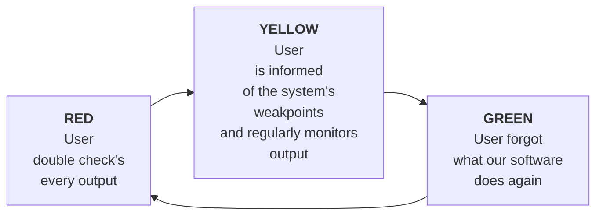

*Trying harder is never the solution*

So what are some tactics we can employ?

--- 
## Right to an Explanation
*Show your homework*
- All the input you are working with
- Cross-reference information
- Your pre-processing steps
- Raw output
- Alternative predictions
- Historic results
---
## Risk Factors
*Risky results imply the existence safe results.*
- Missing or corrupted input data (blurry or redacted documents)
- Exotic formats
- Large input data sets
---
## Minimize Variance
*A series of humble predictions over one big one*

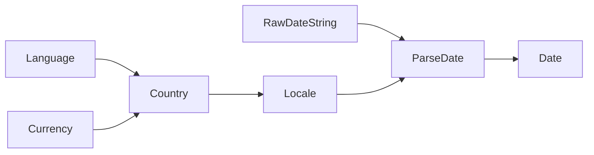
---
## Confidence, over availability 
*It's better to show no answer than a wrong answer*

- Horizontal confidence (historic)
- Vertical confidence (cross-referencing context)
---
## Operator control
*Always have a human at the wheel*
- Dry running
- Manual preferences
- Safe Roll-back
---
## End-user involvement
*Trust is a two-way street*
- BYO Training Data
- Custom post-processing rules
- AB test different predictors
---
# Our Strategy
- Splitting Predictors
- Competition
- User Feedback
- Measuring Correctness
---
## Splitting Predictors
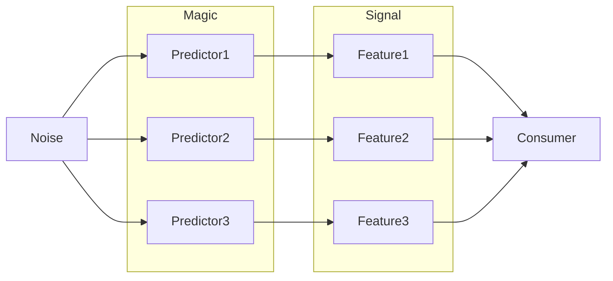
---
## Competition

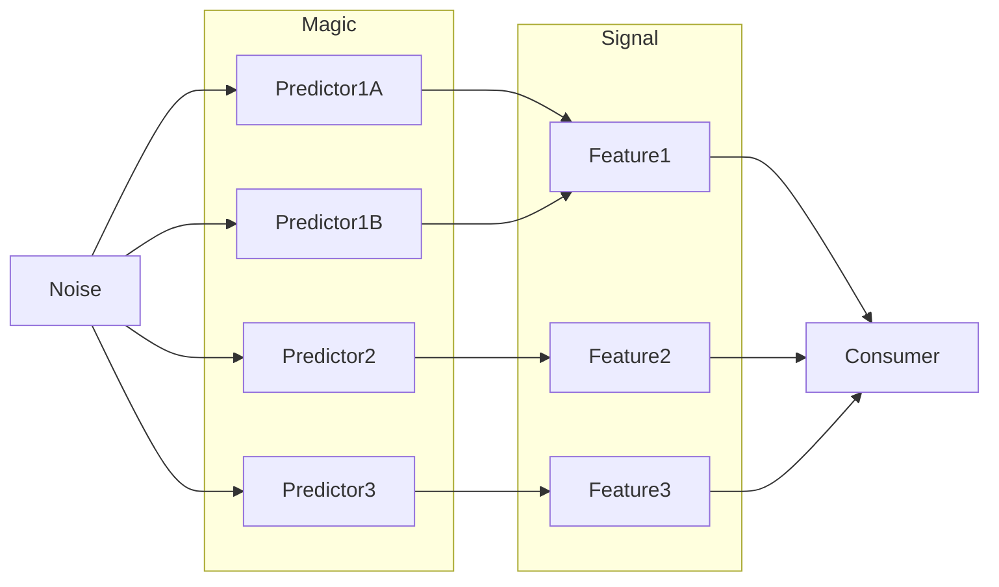
---
## User Feedback
*End users evaluate whether our prediction was correct or not.*

---
## Correctness
*What does 'correct' mean anyway?*

| Invoice ID | Predicted Due Date | Actual Due Date | Evaluation                       |
|------------|--------------------|-----------------|----------------------------------|
| 1001       | 2023-06-15         | 2023-06-15      | Correct                          |
| 1002       | 2023/07/20         | 2023-07-18      | Incorrect (format mismatch)      |
| 1003       |                    | 2023-08-01      | Prediction empty                 |
| 1004       | null               | 2023-09-10      | Prediction null (Abstained)      |
| 1005       | 05/30/2023         |                 | Evaluation empty (User cleared)  |
| 1006       | 2023-12-01         | 9999-12-31      | Impossible date given            |
| 1007       | June 11, 2023      | 2023-11-11      | Incorrect (format mismatch)      |
| 1009       | 2023-10-10         | null            | Actual date was null(unevaluated)|
| 1010       | 07-15-2023         | 2023-07-15      | Correct (acceptable format variation) |
| 1016       | 20230820           | 2023-08-20      | Correct (format mismatch but identifiable) |
| 1019       | 23-04-31           | 2023-04-30      | Incorrect (invalid day and format mismatch) |

---
### Evaluation Result Types
- **Correct** (Yay happy flow!)
- **Incorrect** (Prediction was not the same as the evaluation)
- **Abstained** (Predictors refrained from giving a prediction due to lack of confidence)
- **Unevaluated** (User didn't interact with the prediction so we can't be sure its correct or not)
- **Cleared** (User actively removed the prediction and didn't provide an alternative)

---
## Correctness Matrix

|Evaluation➡   Prediction ⬇    |   |"Foo"        |"Bar"        |""         |_null_       |
|-----------------------------------|---|-------------|-------------|-----------|-------------|
|**"Foo"**                          |   |Correct    |Incorrect  |Cleared  |Unevaluated|              
|**""**                             |   |Incorrect  |Incorrect  |Correct    |Unevaluated|
|_**null**_                         |   |Abstained  |Abstained  |Abstained  |Abstained  |

---
# Our Platform

---

![[Pasted image 20231017232448.png]]

---

## Prediction Methods
- Rule-based (RegEx, Arithmetic)
- Deep Learning Neural Networks on Azure ML
- Azure OpenAI service
- Azure Document Intelligence
---
### Rule-based
# 🤖
### Pros:
- Easy manual intervention!
- Explainable
- Lends itself to procedural generation
### Cons:
- Does not scale well
- Needs a ton of pre-processing
---
### Azure ML Studio
![[10166-icon-service-Machine-Learning.svg|100]]
### Pros:
- Great platform for AIOps
- Straightforward to improve
### Cons
- Labour intensive
- Blackbox 
---
### OpenAI Service
![[ChatGPT_logo.svg|100]]
### Pros:
- Will correct your OCR
- Can attempt to explain itself
### Cons
- Results vary

---
### Document Intelligence
![[00819-icon-service-Form-Recognizers.svg|100]]
### Pros:
- Solves the Document Recognition problem
- Recursive recognition
### Cons
- Need to parse a lot of output
- US documents only
----
# Learnings
---
## Try out all the things! 🍝
---
## Create a Correctness Matrix

|Evaluation➡   Prediction ⬇    |   |"Foo"        |"Bar"        |""         |_null_       |
|-----------------------------------|---|-------------|-------------|-----------|-------------|
|**"Foo"**                          |   |Correct    |Incorrect  |Incorrect  |Unevaluated|              
|**""**                             |   |Incorrect  |Incorrect  |Correct    |Unevaluated|
|_**null**_                         |   |Abstained  |Abstained  |Abstained  |Abstained  |

---
## Have a human at the wheel 🐵

- Dry-Running
- Rollback Predictors
- Manual Priority Overrides
---
## Beware of totems 🗿
Measure everything. Don't send users results unless you can measure the predictors performance. Magic systems that aren't measured become totems. Being supported by belief and superstition over real results

---
## Build trust first

*If there's one thing you take home today*

---
# Thank you!

if you are interested, this talk was based on my presentation @
![[MagicInProductions.svg]]
