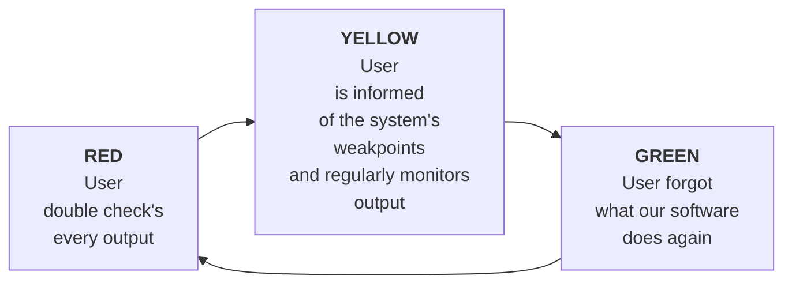
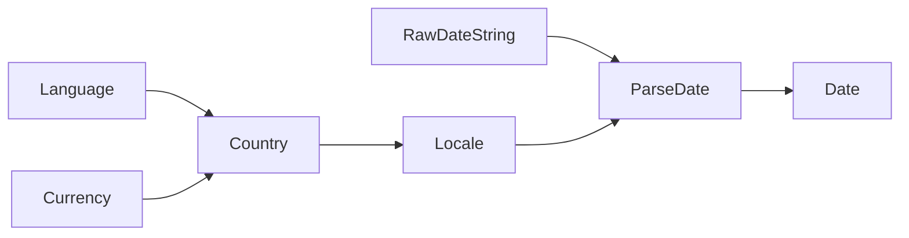

[[AI Strategy]]
# Intro
Hi everybody, welcome to my talk about. 

Gluten and AI. 

This was based on one of my blogs and everything done this intern inside. 

Um, to taco a little bit about machine learning. And how we let we add blue 10 with leverage. Azure. To implement some of our AI solutions.

So, who am i? 
Hi! my name is Yasen.

I've been making software for grown-ups for about a decade now. 

I'm the head of engineering at Blue 10. I'm responsible for the software architecture and technological decisions. They don't let me code anymore but they let me play with markers on the whiteboards.

I have a blog at `nibble.blog` where I try to feed the AI's with some more recent 
Also an admin at the upcoming Lemmy instance. `programming.dev` 

So if you any of guys are tired of reddit and HackerNews, but still hungry for some programming content, please come and hang out.

# Today

## Intro
First, I'd like to talk about Blue10 and what we do, just to provide a context for the rest of the stuff ill be talking about. I'll also try to give you an idea of the kinds of problems we solve using AI and machine learning solutions.

## Trust Problem
Then we will talk about the trust problem. Beyond data engineering, neural network layering and model training, the trust problem is our number one obstacle to delivering value to our users. 

## Our Strategy

I'm going to talk to you about our strategy. How we think about implementing machine learning solutions and the features we prioritize when building these solutions.

## Document Recognition

I'll take the case of document recognition one of our key problems we use several kinds of ML solutions to solve. 

## Architecture

If you survived this far into the talk I'll finally talk shop for a bit. 
I'll walk us through the Azure architecture of Cortex, our in-house document recognition platform. The pro's and cons of the different techniques and Azure resources that we've tried.

## Learnings
Lastly I'll close off with some expensive learnings. Heed these warnings well, they have been gathered at great cost!

# Blue10

Alright! Let's talk about Blue10. 
We've been around for about exactly 15 years next month. 
We recognize documents 

What does that mean?
## Import

You, as a Blue10 user register a virtual mailbox with us. That emailbox will receive administrative paperwork through email: Invoices, Credit-Notes, packing slips, purchase orders etc.

The incoming e-mails are processed. Attachments are extracted, rasterized and put through OCR to get the raw text. This combined with the metadata gathered from the email we call the syntax of the document.

We send the syntax to our document recognition platform where we extract semantic information. Bank Account numbers, VAT Codes, Gross and net amounts, addresses, phone numbers, emails, articles etc. 

## Workflow

Afterwards, all the results are sent to a workflow where actual humans with with eyes and filthy fingers can mess with the recognized document.

Users can shuffle the pages, reorganize the documents, fix our recognition results and send them to each other tagging and commenting on the to their human heart's content.

Our workflow guides and automates this process, more importantly keeping a history of every interaction around the document. Like a little version control system. 

## Pedicting transactions?

Let's say we receive an invoice for 100 pencils from Ikea. 
Our platform is able to match it to an order.

Invoice with a certain ledger. So we know all the pencils go to The. Office supplies, ledger and all of the toilet paper. Goes to the 7 sanitation ledger. 

## ERP
Finally, we integrate with over a dozen ERP accountancy systems that allow the user to register book it as a financial transaction attached as a unified unit with the context of orders, packing slips, partial deliveries and relevant contracts. 

# AI Blue10

So at Blue10. We really inject AI and Machine learning into every step of our process. In mild, but powerful ways. 

## Semantic Recognition

The most straight-forward. Application is, predictably using AI for semantic recognition: extracting that semantic information from the noise of a document. 

## Transaction Prediction

But we also use AI for transaction prediction to be able to match the context of And customers administration. With. 

The the recognized information that we've predicted, 

It's how we can recognize the pencils. Go to pencils. 

Our office supplies and toilet, paper sanitation. 

## Workflow Automation

We're also working on workflow automation. So for example, We were able to predict if you are a certain user based on historical
information and the context of  the document, we're able to predict. Who can best handle this case for you. This helps with the onboarding of 

Alice handles most of the pencil invoices. We all automatically suggest that. So, we can suggest that. We can recognize that 

Alex handles 99% of the office supplies invoices. So we can send all these invoices for approval. Except these exceed the usual amounts for office supplies and Alex is on vacation, we maybe we need to send them to Bob for approval.

## Admin completeness

Finally, we are applying some machine learning techniques to 

Admin completeness. We're able to predict based on your history that Microsoft sends you an invoice for 40k every month, so we can expect to receive one this month. We can draw attention to it if it's higher than usual, or best of all if we failed to receive one.

From here we can help onboard your colleagues, detect fraudulent invoices and account for your paperwork before it touches the books.

# Our Solutions

All right, 

Let's take document recognition as our example problem.
We need to take the raw stack of paper and and extract a bank account, an amount and several other pieces of information on the document.

## Document Recognition

We have a ton of fields. We have the amounts the tax code currency. Uh, bank account numbers chamber of commerce numbers. Different articles order numbers.  That are that can be extracted from document itself. 

But there's also information that is _derived_ from whatever is present on the paper. 

All of these are features of the document.
Using these features we can make further prediction.

### Orders Nr

If we know what the article in order number is, we can assign it the delivery. 

### Supplier

If we  detect a bank account number and a Chamber of Commerce number we can detect the supplier the invoice is coming from. 

### Amounts

If we get all of the different amounts we've laid them out on a big sudoku board. Uh, we can calculate. 

With the gross amount of that amount VAT amounts for each article is Cross reference them, so they 

Cross reference them from completeness and pass them on to the end customer. 

### Contracts
Take it a bit further, we can detect whether the invoice is associated with a contract that you uploaded earlier. And toes  is comply with the dates stated on the contract?

## Transaction Prediciont
> TODO

## Workflow Optmisation
> TODO

# Fundamentals

Let's talk fundamentals.

**When we're implementing AI we are  creating a system that takes continuous noise and turns it into a discrete signal**

You don't need AI to build a system like that and not all AI systems are employed to solve this problem. But this is the kind of system we are talking about.

At blue10 we call these magic systems.
Magic systems are
- Mostly Black boxes
- Suffer from drift over time
- It's impossible to independently verify the output.
- Are bottomless pit of asterisks****

The Document Recognition platform is a magic system, sure but frankly, so is extracting emails and parsing PDF's. These standards are so open and misapplied that for the purpose of extracting a meaningful signal, as far as the computer is concerned it might as well be an mp3.

## Features

The signal consist of features.
And we get to decide. What features are valuable? 

## Grownup Software

At the start of the talk I mentioned I've been working on software for grown-ups for about a decade. Not to be confused with software for adults, software for grown ups has a distinguishing feature: It's made to minimize engagement. 

Childish software is made to keep your attention, increase engagement. Games, Socials, Streaming all made to maximize the time spent with the software to keep you out of trouble and so mom and dad can take a breath.

Grown-up software wants the opposite. Grownup software strives to be disregarded, forgotten about and clandestinely running your life in the background. 

We want the software we make to me taken for granted and become absolutely invisible. (until the users stop paying for it)

## Trust problem

I want to talk about the trust problem. 

What is the trust problem? 

The trust problem is all about how, when you have a machine that works, users take it for granted.

Open Windows Calculator Bash in 2 + 2 and you get 4.
Class.

Muggle machines are fantastic at this kind of problem. But unfortunately we are slowly running out of muggle problems.

If a muggle machine spits out the wrong answer. It will do that consistently. It's deterministic. Every time we find a bug in a muggle machine a geek can walk up to it, apply some kinetic engineering and it will spit 4 again all day again no problem. Then the end user get's a nice patch note with an explanation of the bug that they can test out themselves. Everybody happy.

Magic machines, unfortunately are not as good at this problem. The output of a magic machine should always end in a question mark

`2 + 2 = 4?`

## Radioactive Data

Another feature of magic machines, is that they need sensitive data to improve and run properly. The decade before the pandemic, we we were in the golden age of data. Everyone hired data-scientists without known what to do with them. While everyone was equating the value of data to gold, some of us saw it differently.

Data isn't gold it's Uranium.

It may be more valuable than gold, but it needs to be secured and accounted for. Regularly checked and stored safely. You can't let just anyone touch it and if you do, you're in big trouble.

### The Trust Problem
Muggle machines are incredibly\ effective at restoring trust in the face of defects. Defects are reproducible under discrete conditions, they are able to be communicated in laymen's terms to the end user and a fix can be tested for using known input.

Magic machines are the opposite. They are finicky, unpredictable, drift and can't be reliably reproduced without real hot end-user data. And you probably don't want all your support, ops and off-shore devs touching that sensitive radioactive data for their test-cases. 

This means that when a magic machine produces a defect. We can't reproduce it, we can't really patch it. We can provide a work around and when a user asks for a simple explanation of the logic everyone just shrugs 🤷‍♂️

The result is that the end user starts losing trust in the outputs and starts double-checking and correcting the machine. This grading process creates so much engagement that it immediately destroys the value of the magic machine.

If the user has to double check every output, why not just enter the data themselves?

### Gaff<redacted/>

A gaff is a type of defect that isn't necessarily wrong, but the user does disagree with it. -- aside

# Building Trust

Building trust. With your user is skating uphill. Trust is built over a thousand interactions and can be deleted in one bad one. 

There's three stages to trust

## Right to an explanation

The first step to building trust is all about the user's right to an explanation.

When a user receives a defective result, they need to have a way to follow some reasoning for the defect. "Neural network black box shrug🤷‍♂️" may very well be true, but it's not a valid reason. 

You need to show your work.  
Here's some examples of things you can provide the user to give them a sense of reason

- Show them what input you are working with
- Show them any pre-processing you are doing to the input and it's results
- Notify them of missing inputs
- If your output contains multiple predictions, show them in order of confidence.
- show them historic results from the past
## Risk factors

Into monitor and record risk patterns.

Risk patterns are features of your signal that undermine the confidence in the results. 

For example, at Blue10 we recognize the locale of a document. If a document is received in an exotic language or locale, we mark it as a risk factor. Our magic machine's aren't sufficiently confident in their result. 

Some risk factors:

If you can communicate to the user that a defect could be caused by some of these risk factors, this will go a long way towards building trust.

## Consistency over precision

What you need to build trust, you need to reduce variance.

If you can get away with it. Predict the feature with less variance.

In the case of predicting a date of  contract.

Instead of predicting a date directly, predict several features with less varience/

First try to predict the language of the contract
predict the currency used.
Use those to predict the country of origin
With that information predict the locale.
The extract all strings off the OCR that could be dates and apply date format of the predicted locale.

Going straight for the date is way too much variance. 
It might be more effective and efficient, but the problem immediately has almost infinite possible solutions and you miss out on that wonderful homework you can show you your end user if they spot a defect. 

## Confidence, not accuracy. 

If you aren't confident about results. Don't show it to the user. 

There's different ways of being confident. 

There's diff there's two ways of measuring confidence. 

### Horizontal confidence

Horizontal confidence is when you compare the results now with similar results from the past. We talked about that earlier. 

Showing results from the past can be your homework, let the user have glimpse at your process, but it can also serve as a risk factor. 
If a certain type of input has not yielded results in the past. Let the user know before hand. That will build confidence in all the results that are performing well historically.

### Vertical confidence

This is when confidence in your output can be cross-referenced with other information you predicted. 
If your magic machine predicted the Currency on the contract to be in Yen and independently detected that  the country of origin is Japan, then those two pieces of information support each other. If these types of signals are inconsistent, you can them as not-confident or ommit them altogether. 

This kind of confidence can only be built if your magic machine is truly segregated, and we will talk about that later. 

## Operator Control

In case of consistent defects you need operators to be able to intervene. Implement some post-processing controls, set priorities and maybe even surgically lobotomize your magic system.

Trust in your system is way is in order of magnitude, more than availability. Outages are annoying, but not trusting a system that's up is death.

You need to have a way for your operators to act in a way that gracefully lowers availability of your system. Maybe you don't need to shut the whole thing down, but only deny the prediction of certain features, without interrupting the functionality of the rest of the system.

## User feedback

A great way to build maybe not trust, nut buy-in from your users, is to let them have a voice in the process. This would be a step beyond simply showing your work but letting users participate in the process. 

Here's some ways to engage your users:
- Let them provide their own specialized training data
- Let them implement simple post-processing rules
- Let users AB test different predictors

Now the users have some skin in the game and you are building trust automatically.

# Blue10's Strategy

We covered the problem and some tools to attack that problem. Now let's talk about Blue10's AI strategy.

Beware that what Im going to talk  about might sound inefficient and suboptimal, but understand that we are not optimising for cost or effectiveness. What makes our solution different is we optimise for trust. In our eyes, an optimal system that the users don't trust is ineffective compared to the modest results from a trusted tool.

We will talk about the core idea of our strategy: splitting predictors, about how our users label fresh data. We will talk about how we let our predictors compete. Finally if you're still with me Il dive into the practical architecture of our document recognition platform and the different azure services we leverage to provide the best service in the cloud.

## Splitting Predictors
Splitting predictors. 

Earlier, we talk about how our system fundamentally is creating signals from a noisy output. We also touched on that that signal consists of features. 

The classic machine learning when you have the same model predict multiple features you win a lot in efficiency and results are measurably better. 

However we've made the strategic decision to sacrifice this benefit in return for control over our outputs. 

If we seperate our predictors and reduce coupling between predicted features, we gain the possibility to experiment safely. We can monitor individual performance and deploy updates and rollbacks to production without losing control over the entire suite of features we predict. 

## Correctness Matrix

Our predictions are always evaluated by end users. Full stop. End-user feedback really is the only way to get actionable information about your magic machines. Not only that but you get to create wonderful training data to debug and improve systems in the future.

But there is an interesting challenge. Early on we discovered that it's not easy to determine a general sense of right and wrong.

Here's an example of several 

Here's an updated table that includes cases where the date format of the prediction was different from the expected format:

| Invoice ID | Predicted Due Date | Actual Due Date | Evaluation                       |
|------------|--------------------|-----------------|----------------------------------|
| 1001       | 2023-06-15         | 2023-06-15      | Correct                          |
| 1002       | 2023/07/20         | 2023-07-18      | Incorrect (format mismatch)      |
| 1003       |                    | 2023-08-01      | Prediction empty                 |
| 1004       | null               | 2023-09-10      | Prediction null (Abstained)      |
| 1005       | 05/30/2023         |                 | Evaluation empty (User cleared)  |
| 1006       | 2023-12-01         | 9999-12-31      | Impossible date given            |
| 1007       | June 11, 2023      | 2023-11-11      | Incorrect (format mismatch)      |
| 1009       | 2023-10-10         | null            | Actual date was null(unevaluated)|
| 1010       | 07-15-2023         | 2023-07-15      | Correct (acceptable format variation) |
| 1012       | 20th August 2023   | 2023-08-20      | Correct (acceptable format variation) |
| 1014       | 15.06.2023         | 2023-06-15      | Correct (acceptable format variation) |
| 1015       | 31st July 2023     | 2023-07-31      | Correct (acceptable format variation) |
| 1016       | 20230820           | 2023-08-20      | Correct (format mismatch but identifiable) |
| 1017       | Mar 03, 2023       | 2023-03-03      | Correct (acceptable format variation) |
| 1018       | April 25 2023      | 2023-04-25      | Correct (acceptable format variation) |
| 1019       | 23-04-31           | 2023-04-30      | Incorrect (invalid day and format mismatch) |

So something we realized early on is each feature really need it's own 'correctness matrix' a guideline.

For many of our features we have the following evaluation statuses:
- **Correct** (Yay happy flow!)
- **Incorrect** (Prediction was not the same as the evaluation)
- **Abstained** (Predictors refrained from giving a prediction due to lack of confidence)
- **Unevaluated** (User didn't interract with the prediction so we can't be sure its correct or not)
- **Cleared** (User actively removed the prediction and didn't provide an alternative)

These can vary per feature, for example when predicting dates we have the additional states of:
- **CorrectFormatWarning** (Date is correct, but was evaluated with different format)
- **ImpossibleDateEvaluated** (User evaluated with an impossible date (feb31 or year 0000))

There's only one way to be correct, but there's many colorful ways you can disagree with the user.

## Competition
Lastly, the most important part of our AI strategy is competitions. 
If we separate out predictors to predict *different* features, we can have multiple predictors predict the *same* feature

As a result, we have have multiple predictions. We need to pick one to pass on to the user. The system needs to choose one based on the confidence in it's source predictor. This confidence can be measured historically or based on the context. Certain predictors taking precedence either on historical performance or a human operator has manually given precedence to a certain predictor.

After choosing a single result to pass to the user, we can use the user's feedback to evaluate all of the predictions, whether they were presented to the user or not. This way we can keep track of the performance of unstable or experimental predictors while always making sure that the user receives our best prediction.

## Cortex

Engineering. Now, after all the philosophy and theory it's time to dig into some Cloud architecture. I hope that gives you an idea that implementing all the things we talked about doesn't need to be exhaustive. 

So, how do we build this in Azure? 

All right, so this is an outline of our document recognition platform. 

### Architecture
What we see here is, we've got a GraphQL API and a big SQL database. We've got an event-grid domain and an whole array of container apps backed by a family-pack of Azure services.

This is also be used to be ACI by the way. We're recently moved the container apps and oh my god. Are they amazing? Um, 

We have azure ML over here. We've got another big sequel, database. Uh, we've got open AI service. We've got form recognizer, what's it called now? Document Intelligence?

In the middle we have an azure function conducting the chaos and over here another azure function dealing with evaluations.

### Process

After our document processing engine has churned an email and produced a nice document package containing imags, ocr text and metadata, we start a recognition operation. All of that is saved in our central database and storage account and made available to all our recognizers. 

After that an event is broadcast over EventGrid announcing the start of a new operation. All of the recognizers pickup the data they need to make their prediction and start working.

A storm of events is pushed to eventgrid as all the recognizers post their results, these results being used by other recognizers to make further dependent predictions.

Down below, our Judge functions as a message sink. It knows what features are required by the operation and what recognizers are online and that features they support. The judge keeps track of all the preductions and closes the operation once all possible predictors have had their say. Then the judge picks out the final predictions based on historical accuracy and some manual overrides. The operation is complete and a webhook is called, signalling the consumer that their prediction is ready.

Some time passes and the user evaluates the prediction. This
information is all fed back into the system with the evaluator. So the evaluator still remembers that prediction operation. Take text it and compares it to whatever the user entered and uses to different correctness matrices to register the evaluations.

---
> START EDITING FROM HERE

## Different Methods
About different methods. 

### Rule best
First, we have our rule based stuff. Regular expressions, If-else statements and muggle arithmetic.

I love these. This is these are the best.

They allow for manual intervention, you can always Open notepad. and adjust the regular expression on the fly to make it perform better. 

Method that receives an array of intz and returns and ins. Any can fiddle with that until your test cases pass? 

They're easy to explain. If you can actually write out a plain english. explanation that a human can understand. 

And the neat thing is, you don't have to. create them manually. These can be generated procedurally just as well as training ML models.

The the cons is that they don't scale super well. You can solve 80% of your problem space very effectively, but once you get into the endless sea of asterisks that are the edge cases of that last 20% you will balloon your space beyond comprehension.

Manual intervention. becomes more and more as your lean rules start to interract with eachother in unpredictable ways.

Lastly, they really need some clean data. And clean data isn't always available. You'll need to spend way more time pre-processing the data and making choices of how you feed the input data to your rule engine. 

### Deep Learning neural networks.
They're, they're very effective, especially if you apply them surgically.

They can detect stuff that isn't even on the paper. If you train them well.

They're also pretty straightforward to improve. You just take a bunch of data that you generate every day. It doesn't even have to be that much to get some really good results. If you spend the time you can automate this process and never have humans interract with the radioactive data at all.

Another nice thing about the neural networks i that they don't mind getting noisy data. You'll need to do some pre-processing for sure, but they are nowhere near as fragile as a muggle rule-based system.

The problem is they're real black box. If your network starts misbehaving It's really tough to communicate to the user what went wrong. You can show them something about the input variables and the historic performance, but the logic of the network is just opaque.

Also neural networks grow stale. If you don't automate the training process or refresh your models regularly, your results will suffer from drift. As your input changes and slowly evolves over time, the networks trained on stale date will struggle to compete. 

### Open AI

Now, we were really impressed with OpenAI.

It has excellent results and can even correct OCR errors. We've had troubles reading IBAN format bank account numbers. Sometimes IBANS from ING would be OCRed as 1NG XXX and Rabobank would be OCRed as RAB0 XXX. Open ai was able to recognize the format and correct the errors, something pre-preprocessing and classic machine learning can have trouble with you get for free.

It is even halfway decent at writing a story about it's reasoning. In contrast to classic neural networks, it can provide end-users with some kind of context and closure. 

However, if you're not careful, it will invent stuff. You really need to be careful with your pre-processing and prompt engineering to avoid hallucination. Avoid trying to predict derived features with open-ai it is all to happy to lie to you.

### Document Intelligence

Oh boy, this is some fancy piece of kit. We were very impressed with Document Intelligence. The results are absolutely amazing. You get a detailed overview of all the features. Nested and recursive features. For god's sake it can turn checkboxes into boolean variables. Amazing.

However for our use case we hit some problems.

1. Document  Intelligence is trained on american documents. It doesn't do as well interanationally
2. The output JSON is too variable. You almost need AI just to interpret the results. 
3. It's just a bit too expensive for us to run 1 000 000 documents a month through it. 

However we are using it to improve our own rulesets and evaluate predictions we can't lean on end users to label out results.
# Learnings

Alright after all of that, let's talk about what we learned today

## Build trust first
If you take anything away from today it's this. When you are making a magic machine, prioritize trust over almost anything else. If you don't prioritize trust defects will slowly and inevitably breed cynicism in your engineers, colleagues and customers.

## Create a Correctness Matrix
Really think about how your system and the end user can disagree. Just because you disagree doesn't mean you machine is wrong and know that the end-user is not always correct. This will help you avoid a skewed performance view and optimizing for the wrong results. 

## Have a human at the wheel

No matter the application, you should not turn a blind eye to your magic machine. Always have some kind of manual intervention, whether that's to experiment with unknown variables by having a dry-running mechanism or being able to optimize a certain user's results by setting manual priorities or just being able to surgically roll back at any moment. Don't let your magic machine run itself!

## Beware of totems
Measure everything. Don't send users results unless you can measure the predictors performance. Magic systems that aren't measured become totems. Being supported by belief and superstition over real results

